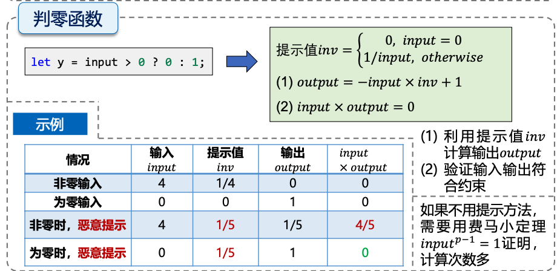
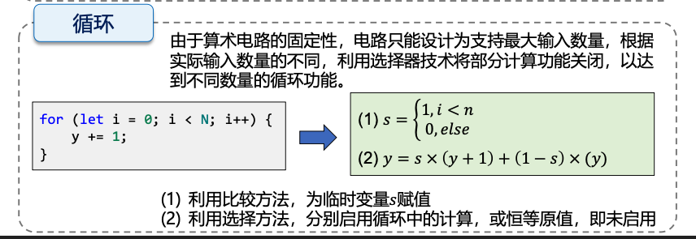
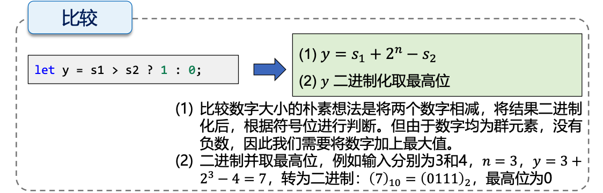

# 第 2 课 练习

今天的练习是动手编码练习。 尝试自己编写以下电路。 如果遇到困难，可以查看解决方案。

如果您需要查找 circom 语言功能或语法，请查看 [circom 文档](https://docs.circom.io/circom-language/signals/)。 我建议尝试在 [zkREPL](zkrepl.dev) 中构建这些电路，以实现快速迭代。

我建议按顺序进行这些练习，因为后面的电路可能建立在前面的电路之上。

## 参考

### 域大小

circom 中的所有信号都是素数域中的域元素

```
r = 21888242871839275222246405745257275088548364400416034343698204186575808495617
```

这是一个 254 位素数，称为 [BabyJubJub](https://www.cs.utexas.edu/users/moore/acl2/manuals/current/manual/index-seo.php/ZKSEMAPHORE____BABY-JUBJUB-PRIME) 素数。 这是 BN254 的曲线顺序，这是以太坊和（以前的）ZCash 使用的配对友好椭圆曲线。 您可以在 Jonathan Wang 的优秀文档 [此处](https://hackmd.io/@jpw/bn254) 中阅读更多关于 BN254 的信息。

### 建议和常见问题

如果您正在使用 zkREPL 的输入注释功能测试您的电路（特别是如果您使用负数），请注意您需要将数字括在引号中，并且您需要编写 它们作为非负残基。 这是由于 JSON 无法解析大整数。

例如，测试值为`-1`的输入信号`x`应如下所示：

```
"x": "21888242871839275222246405745257275088548364400416034343698204186575808495616"
```

忘记打引号是测试失败的常见原因。

## 练习

### 转换为bit位 Num2Bits

- 参数：`nBits`
- 输入信号：`in`
- 输出信号：`b[nBits]`

输出信号应该是长度为`nBits`的位数组，相当于`in`的二进制表示。 `b[0]` 是最低有效位。

[解决方案](https://github.com/iden3/circomlib/blob/master/circuits/bitify.circom#L25)

* [x] 代码见[Num2Bits.circom](/lecture2/Num2Bits.circom)

### 判零 IsZero

- 参数：无
- 输入信号：`in`
- 输出信号：`out`

要求：如果`in`为零，`out`应为`1`。 如果`in`不为零，`out`应为`0`。 这个有点棘手！


[解决方案](https://github.com/iden3/circomlib/blob/master/circuits/comparators.circom#L24)

答：这个课上讲过，思路是：



代码见[IsZero.circom](/lecture2/IsZero.circom)。关于`inv`的提前计算，如果用if判断：
```circom
signal input in;
signal inv;

if (in == 0) {
    inv <-- 0;
} else {
    inv <-- 1 / in;
}
```
这里会报错error[T3001]: Exception caused by invalid assignment: signal already assigned，因为所有signal都是Unknown的，包括`in`，编译时会看到`inv`有两个赋值语句，而`signal`只能赋值一次，因此会出现编译错误。`inv`直接用条件表达式进行赋值：
```circom
signal input in;
signal inv <-- in == 0 ? 0 : 1/in;
```

### 相等 IsEqual

- 参数：无
- 输入信号：`in[2]`
- 输出信号：`out`

要求：如果 `in[0]` 等于 `in[1]`，则 `out` 应为 `1`。 否则，`out` 应该是 `0`。


[解决方案](https://github.com/iden3/circomlib/blob/master/circuits/comparators.circom#L37)

答：判断两个数是否相等就是看这两个数的差是否为0，也就是用`in[0] - in[1]`作为IsZero的输入信号。代码见[IsEqual.circom](/lecture2/IsEqual.circom). 简洁点直接判断`in[0] - in[1]`是否为零，代码见[IsEqual2.circom](/lecture2/IsEqual2.circom).

### 选择器 Selector

- 参数：`nChoices`
- 输入信号：`in[nChoices]`, `index`
- 输出：`out`

要求：输出`out`应该等于`in[index]`。 如果 `index` 越界（不在 [0, nChoices) 中），`out` 应该是 `0`。

[解决方案](https://github.com/darkforest-eth/circuits/blob/master/perlin/QuinSelector.circom)

答：参考[解决方案](https://github.com/darkforest-eth/circuits/blob/master/perlin/QuinSelector.circom)，代码见[Selector.circom](/lecture2/Selector.circom). 思路是循环遍历下标，用i和index是否相等作选择器，如果i和index相等，选择器置1，不等置0。类似于下面这种思路：

最后再做累加。在[解决方案](https://github.com/darkforest-eth/circuits/blob/master/perlin/QuinSelector.circom)中先要求index必须在范围[0,nChoices)。
```circom
// Ensure that index < choices
component lessThan = LessThan(4);
lessThan.in[0] <== index;
lessThan.in[1] <== choices;
lessThan.out === 1;
```
但是本题中允许index越界，如果index越界，约束`lessThan.out === 1;`就不会满足。可以不加这个约束，如果index越界，就不会和遍历的每个下标相等，每次累加的都是0，最终累加结果也为0，将累加结果赋给`out`，输出0。
### 判负 IsNegative

注意：信号是模 p（Babyjubjub 素数）的残基，并且没有`负`数模 p 的自然概念。 但是，很明显，当我们将`p-1`视为`-1`时，模运算类似于整数运算。
所以我们定义一个约定：`取负` 按照惯例认为是 (p/2, p-1] 中的余数，非负是 [0, p/2) 中的任意数

- 参数：无
- 输入信号：`in`
- 输出信号：`out`

要求：如果根据我们的约定，`in` 为负数，则 `out` 应为 `1`。 否则，`out` 应该是 `0`。 您可以自由使用[CompConstant circuit](https://github.com/iden3/circomlib/blob/master/circuits/compconstant.circom)，它有一个常量参数`ct`，如果`in`（二进制数组）在解释为整数时严格大于 `ct` 则输出 `1` ，否则为 `0`。

[解决方案](https://github.com/iden3/circomlib/blob/master/circuits/sign.circom#L23)

- **理解检查**：为什么我们不能只使用 LessThan 或上一个练习中的比较器电路之一？

答：代码见[IsNegative.circom](/lecture2/IsNegative.circom).

```circom
template IsNegative() {
    signal input in;
    signal output out;

    var p = 21888242871839275222246405745257275088548364400416034343698204186575808495617;
    // (p - 1) \ 2 = 10944121435919637611123202872628637544274182200208017171849102093287904247808
    component num2bits = Num2Bits(254);
    component compconstant = CompConstant((p - 1) \ 2);
    num2bits.in <== in;
    compconstant.in <== num2bits.out; 
    out <== compconstant.out;

}
```
这里的`component compconstant = CompConstant((p - 1) \ 2);`中ComConstant参数是计算出的结果，需要注意这里应该输入`(p - 1) \ 2`。如果是`p \ 2`，由于在Circom中运算都会进行模p操作，那么`p mod p = 0`，其实得到的结果为0。而`p`是素数，因此`(p - 1) \ 2`计算的就是p/2的值。也可以像[解决方案](https://github.com/iden3/circomlib/blob/master/circuits/sign.circom#L23)中那样直接将这个值作为ComConstant的参数。
```circom
component comp = CompConstant(10944121435919637611123202872628637544274182200208017171849102093287904247808);
```

如果使用LessThan来解决这个问题，思路是类似这种：

这里就是`y = in - p/2 + 2^253`，y二进制化取最高位，如果为1就表示`in`负数，如果为1就表示`in`是非负数。但是在实际运算中，LessThan中的代码：
```circom
n2b.in <== in[0]+ (1<<n) - in[1];
```
实际上要进行模p运算再赋值([Circom官方文档](https://docs.circom.io/circom-language/basic-operators/#arithmetic-operators)说明了这点)，真实计算的是`y = in - p/2 + 2^253 mod p`。如果`in`在[0, p/2),`y = in - p/2 + 2^253 mod p = 0`。但如果`in`在(p/2, p-1]，就不一定为1了。因为`in - p/2 + 2^253`可能会超过`p`，模p之后二进制的最高位就不再保持为1，最后会得到结果0。

因此在与非常大的数进行比较时，尤其是超过p/2的数，应该逐位比较，小心使用直接加减运算，因为在电路中暗含了模p操作。
### 少于 LessThan

- 参数：无
- 输入信号：`in[2]`。 假设提前知道这些最多 $2^{252} - 1$。
- 输出信号：`out`

要求：如果 `in[0]` 严格小于 `in[1]`，则 `out` 应为 `1`。 否则，`out` 应该是 `0`。

- **扩展 1**：如果您知道输入信号最多为 $2^k - 1 (k ≤ 252)$，您如何减少该电路所需的约束总数？ 编写一个在`k`中参数化的电路版本。
- **扩展 2**：编写 LessEqThan（测试 in[0] 是否 ≤ in[1]）、GreaterThan 和 GreaterEqThan
    

[解决方案（扩展1）](https://github.com/iden3/circomlib/blob/master/circuits/comparators.circom#L89)

答：小于代码见[LessThan.circom](/lecture2/LessThan.circom). 扩展2代码见[Compare.circom](/lecture2/Compare.circom).

小于等于或者大于等于就用`out <== n2b.out[n];`，因为等于情况下为0，应该直接输出1，也就是2^n的二进制表达最高位。小于或者大于用`out <== 1 - n2b.out[n];`，等于时反转一下，输出0。`n2b.in <== in[0] - in[1] + (2**n); `就看是大于还是小于了。
### 整数除法 IntegerDivide

注意：这个电路非常难！

- 参数：`nbits`。 使用 `assert` 断言这最多为 126！
- 输入信号：`dividend`, `divisor` （被除数，除数）
- 输出信号：`remainder`, `quotient` （余数，商）

要求：首先，检查`dividend`和`divisor`是否最多为`nbits`位长。 接下来，计算并约束`余数`和`商`。

- **扩展**：您将如何修改电路以处理负的被除数？
    

[解决方案](https://github.com/darkforest-eth/circuits/blob/master/perlin/perlin.circom#L44)（忽略第二个参数SQRT_P，这是无关紧要的）

答：除数和被除数均为正数，代码见[IntegerDivide.circom](/lecture2/IntegerDivide.circom). 思路是

(a) 先限制`dividend`和`divisor`最多为`nbits`位.

(b) 限制除数`divisor`不能为0.

(c) 计算 `商 <-- 被除数 \ 除数`，计算 `余数 <== 被除数 - 商 * 除数`。

(d) 检查计算得到的余数范围是否在`[0, 除数)`之间。

(e) 约束计算 `被除数 === 除数 * 商 + 余数` 正确。

### 排序 Sort 【可选】

- 参数：`N`
- 输入信号：`in[N]`
- 输出信号：`out[N]`

要求：将输入`in[N]`的`N`个数字按照从小到大进行排列，并输出到`out[N]`信号中。