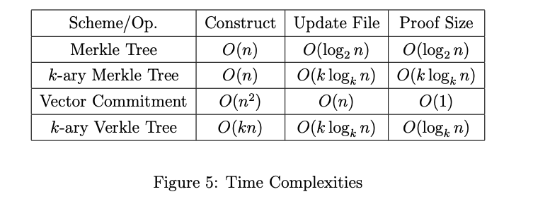

# 第 5 课 练习

1. $KZG$ 多项式承诺方案在 $Setup$ 阶段涉及到计算对秘密评估点 $\tau$ 的幂的承诺，这被称为“可信设置”，通常在被称为“Powers of Tau”的仪式中利用多方计算生成。 假如说有一天，你在一张纸条上找到了 $\tau$ 的值。 你怎么能用它来制作一个假的 $KZG$ 证明呢？

答：我们知道在Setup阶段的$\tau$值，原来的三个步骤：

Setup($1^\lambda,d$) $\rightarrow srs$, srs =(ck,vk)=($\{[\tau^i]_1\}_{i=0}^{d-1}$,$[\tau]_2$).

$Commit(ck;f(X)) \rightarrow C, f(X) = \sum_{i=0}^{n-1}f_iX^i, C = \sum_{i=0}^{n-1}[f_i][\tau^i]_1=[f(\tau)]_1$

$Open(srs,C,x,y;f(X)) \rightarrow \{0,1\}$:

a) Prover 计算$q(X)=\frac{f(X)-y}{X-x}$, 发送证明$\pi = [q(\tau)]_1$;

b) Verifier 验证$e(C-[y]_1, H) \overset{\text{?}}{=} e(\pi,[\tau]_2-[x]_2)$

如今，伪造者并不知道多项式$f(X)$，因此不能计算出$y$，对于一个伪造的$y'$（也就是$f(x) \neq y'$），想要通过发送证明$\pi_{Fake}$通过验证。现在伪造者想要验证者通过验证

$$
e(\pi_{Fake},[\tau]_2-[x]_2) = e(C-[y']_1, H)$$
$$
\Rightarrow e(\pi_{Fake}, H)^{\tau - x} = e(C-[y']_1, H)
$$
$$
\Rightarrow e(\pi_{Fake}, H) = e(C-[y']_1, H)^{\frac{1}{\tau - x}}
$$
$$
\Rightarrow \pi_{Fake} = (C-[y']_1)^{\frac{1}{\tau - x}}
$$

由此伪造出证明$\pi_{Fake}$.

2. 从 $KZG$ 多项式承诺方案构造一个**向量承诺方案**。 （提示：对于向量 $m=\left(m_{1}, \ldots, m_{q}\right)$，是否存在一个“插值多项式”$I(X)$ 使得 $I\left(x_{i}\right)=y_{i}$？）

::: tip 有趣的事实

Verkle 树 [1] 是一种使用向量承诺而不是哈希函数的 Merkle 树。 使用 KZG 向量承诺方案，您能看出为什么 Verkle 树更高效吗？

::::

答：现在要对向量$m = (m_1,m_2,\cdots,m_q)$进行承诺，也就是允许证明任意位置$i$对应$m_i$。首先通过拉格朗日插值，使得一个多项式$f(X)$对任意$i$都有$f(i)=m_i$，根据插值公式，得到
$$
f(X) = \sum_{i=0}^{n-1}m_i \prod_{j=0, j\neq i}^{n-1}\frac{X-j}{i-j}.
$$
接着，KZG对该多项式$f(X)$进行承诺就可以了。

如果证明一个元素，Merkle树需要$O(\log_2n)$大小来证明，而这里可以看到只需要$O(1)$就可以。论文[Verkle trees]( https://math.mit.edu/research/highschool/primes/materials/2018/Kuszmaul.pdf)中给出了与Merkle树证明大小的比较：

3. $KZG$ 多项式承诺方案对关系 $p(x)=$ $y$ 进行披露证明 $\pi$。 你能扩展这个方案来产生一个多重证明 $\pi$，让我们相信 $p\left(x_{i}\right)=y_{i}$ 对于点列表和评估 $\left(x_{i }, y_{i}\right)$ ？ （提示：假设您有一个插值多项式 $I(X)$ 使得 $I\left(x_{i}\right)=y_{i}$）。

答：先构造一个拉格朗日插值多项式$I(X)$ 使得 $I\left(x_{i}\right)=y_{i}(i=0,\cdots, k-1)$，根据插值公式得
$$
I(X)=\sum_{i=0}^{k-1}y_i \prod_{j=0,j\neq i}^{k-1}\frac{X-x_j}{x_i-x_j}
$$
则$I(X)$的因子有$(X-x_1), \cdots, (X-x_{k-1})$，将它们相乘得到零多项式$g(X)=(X-x_1)\cdot (X-x_2) \cdots (X-x_{k-1})$。构造商多项式
$$
q(X)=\frac{p(X)-I(X)}{g(X)}
$$
由于$p(X)$也能整除$g(X)$，因此$q(X)$能整除$g(X)$.具体承诺方案如下：

Setup($1^\lambda,d$) $\rightarrow srs$, $srs =(ck,vk)=(\{[\tau^i]_1\}_{i=0}^{d-1},[\tau]_2)$.

$Commit(ck;f(X)) \rightarrow C, p(X) = \sum_{i=0}^{n-1}p_iX^i, C = \sum_{i=0}^{n-1}[p_i][\tau^i]_1=[p(\tau)]_1$

$Open(srs,C,(x_i,y_i);p(X)) \rightarrow \{0,1\}$:

a) Prover 根据$(x_i,y_i)$计算出$I(X)$与$g(X)$，接着计算$q(X)=\frac{p(X)-I(X)}{g(X)}$, 发送证明$\pi = [q(\tau)]_1$;

b) Verifier 验证$e(C-[I(\tau)]_1, H) \overset{\text{?}}{=} e(\pi,[g(\tau)]_2)$.

英文原文

1. The $Setup$ phase of the $KZG$ polynomial commitment scheme involves computing commitments to powers of a secret evaluation point $\tau$. This is called the "trusted setup" and is often generated in a multi-party computation known as the "Powers of Tau" ceremony. One day, you find the value of $\tau$ on a slip of paper. How can you use it to make a fake $KZG$ opening proof?

2. Construct a **vector commitment scheme** from the $KZG$ polynomial commitment scheme. (Hint: For a vector $m=\left(m_{1}, \ldots, m_{q}\right)$, is there an "interpolation polynomial" $I(X)$ such that $I(i)=m[i]$ ?)

::: tip Fun fact

The Verkle tree [1] is a Merkle tree that uses a vector commitment instead of a hash function. Using the KZG vector commitment scheme, can you see why a Verkle tree is more efficient?

:::

3. The $KZG$ polynomial commitment scheme makes an opening proof $\pi$ for the relation $p(x)=$ $y$. Can you extend the scheme to produce a multiproof $\pi$, that convinces us of $p\left(x_{i}\right)=y_{i}$ for a list of points and evaluations $\left(x_{i}, y_{i}\right)$ ? (Hint: assume that you have an interpolation polynomial $I(X)$ such that $I\left(x_{i}\right)=y_{i}$).

**Note**: [KZG多项式承诺](https://dankradfeist.de/ethereum/2021/10/13/kate-polynomial-commitments-mandarin.html#fnref:1)这篇文章讲得非常详细。

## 参考文献

- [1] J. Kuszmaul. Verkle trees. https://math.mit.edu/research/highschool/primes/materials/2018/Kuszmaul.pdf, 2019.