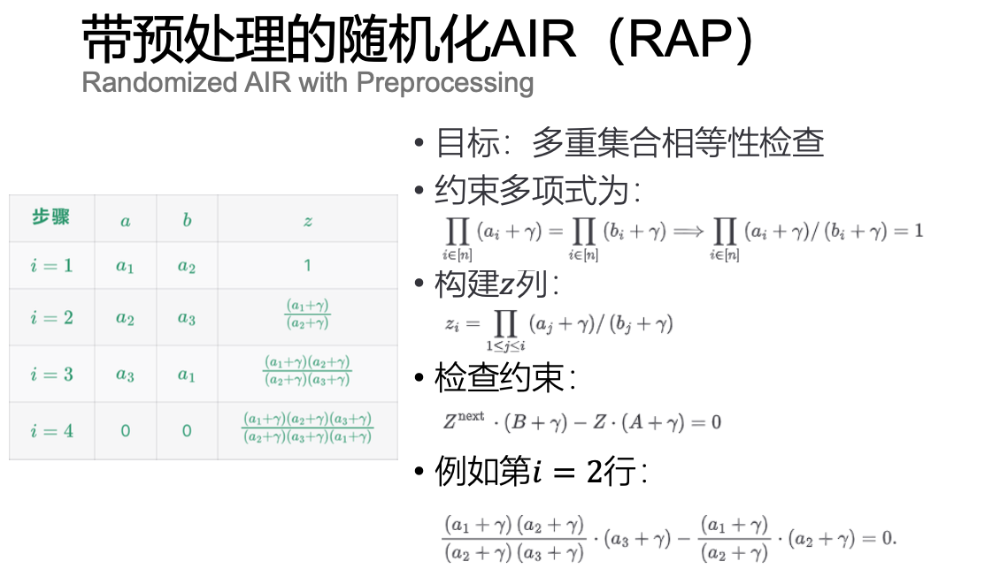

# 第 6 课 算术化

练习1：你能修改课堂上Fibonacci程序，使其成为宽度为 3 的 AIR 吗？

答：与宽度为 2 的 AIR 类似，考虑将斐波那契数列数一行排列三个，然后改变转换程序。

|step|a|b|c|
|----|----|----|----|
|i=1|1|1|2|
|i=2|3|5|8|
|i=3|13|21|34|
|i=4|55|89|144|

转换程序：
* $f_1(X_1,X_2,X_3,X_1^{next},X_2^{next},X_3^{next}) = C - (A + B)$;
* $f_2(X_1,X_2,X_3,X_1^{next},X_2^{next},X_3^{next}) = A^{next} - (B + C)$;
* $f_3(X_1,X_2,X_3,X_1^{next},X_2^{next},X_3^{next}) = B^{next} - (C + A^{next})$.

例如，第 $i=2$ 行的状态转换为：
* $f_1(X_1,X_2,X_3,X_1^{next},X_2^{next},X_3^{next}) = 8 - (3 + 5) = 0$;
* $f_2(X_1,X_2,X_3,X_1^{next},X_2^{next},X_3^{next}) = 13 - (5 + 8) = 0$;
* $f_3(X_1,X_2,X_3,X_1^{next},X_2^{next},X_3^{next}) = 21 - (8 + 13) = 0$.

练习2：你能写一个仅在行 $i=1$ 上应用RAP的多重集合相等性检查的约束吗？（提示：当 $i=1$ 时， $\mathcal{L}_{1}(X)=1$ ，否则为0; 因此只需要在行 $i=1$ 上强制执行一个形如 $\mathcal{L}_{1}(X) \cdot f(X)$ 的约束。）

答：根据提示，在课程中讲到的多重集合相等性检查基础上，左乘 $\mathcal{L}_{1}(X)$ 。

定义 $\mathcal{L}_1(X)=\prod_{x_j \neq x_1} \frac{X - x_j}{x_1 - x_j}$ ,在此例中 $\mathcal{L}_1(X)= \frac{X-x_2}{x_1 - x_2} \cdot \frac{X-x_3}{x_1 - x_3} \cdot \frac{X - x_4}{x_1 - x_4}$ .

约束多项式与 $z$ 列的构造不变，检查约束为：

$$ 
\mathcal{L_1}(X) \cdot (Z^{next} \cdot (B + \gamma) - Z \cdot (A + \gamma)) = 0
$$

当 $i = 1$ 时， $\mathcal{L_1}(X) = 1$ ，就会检查括号里的约束 $Z^{next} \cdot (B + \gamma) - Z \cdot (A + \gamma)$是否为0；当 $i \neq 0$ 时， $\mathcal{L_1}(X) = 1$ ，不用检查大括号里的约束，自然满足等式为0。因此就实现了仅在行 $i=1$ 上应用RAP的多重集合相等性检查的约束。